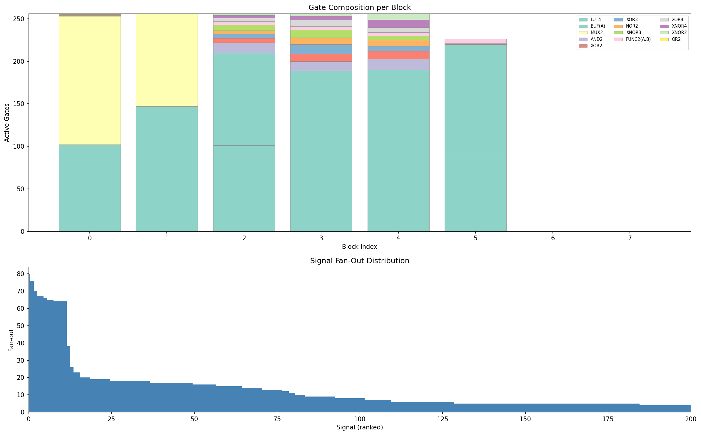
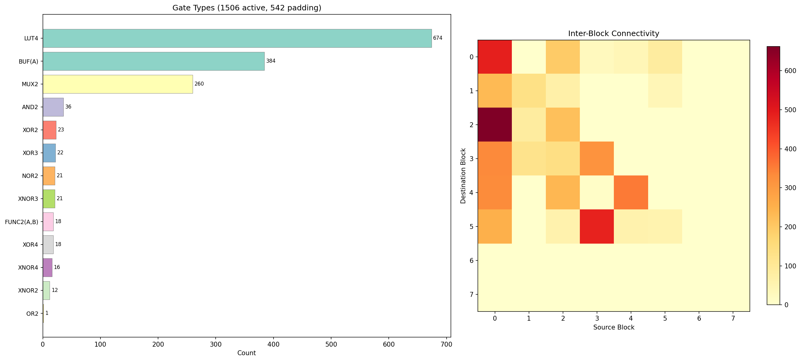

# GPURTL

This challenge provides us a GPU accelerated FPGA simulator. To solve it, I reversed the bitstream format, wrote a python simulator and used Z3 to recover the flag without identifying the underlying cipher.

We are given three files. The simulator [gpurtl](https://github.com/google/google-ctf/blob/main/2019/finals/reversing-gpurtl/attachments/gpurtl), the bitstream [ctf.bin](https://github.com/google/google-ctf/blob/main/2019/finals/reversing-gpurtl/attachments/ctf.bin) and [ctf.lua](https://github.com/google/google-ctf/blob/main/2019/finals/reversing-gpurtl/attachments/ctf.lua), a lua script with the expected ciphertext.

## Reversing the Lua script

`ctf.lua` is short. It defines bit position arrays, writes an input string into a simulator object, clocks it in a loop until a "done" bit is set, then compares output bytes to hardcoded expected values:

```lua
local OUTPUT_BITS = {
    0x4d8, 0x4d6, 0x4d4, 0x4d2, 0x4d0, 0x4ce, 0x4cc, 0x4ca,
    ...
    0x2e8, 0x2e6, 0x2e4, 0x2e2, 0x2e0, 0x2de, 0x2dc, 0x2da,
}

local INPUT_BITS = {
    0xff, 0xfe, 0xfd, 0xfc, 0xfb, 0xfa, 0xf9, 0xf8,
    ....
    0x7, 0x6, 0x5, 0x4, 0x3, 0x2, 0x1, 0x0,
}

local DONE_BIT = 0x4da

local EXPECTED_OUTPUT = {
    0x5c, 0xba, 0x23, 0xde, 0x38, 0x7a, 0x00, 0x67,
    0x7d, 0x8f, 0x7c, 0x6e, 0xf2, 0x11, 0x10, 0xe8,
    0x29, 0x0a, 0x1e, 0xb6, 0xad, 0x34, 0x36, 0x74,
    0x45, 0xfe, 0x3b, 0x6d, 0xf5, 0xa0, 0x8f, 0x9d,
}

local INPUT = "CTF{---------------------------}"

function is_done (sim)
    return sim:read_output_bit(DONE_BIT)
end

function execute (sim)
    sim:write_input_bytes(INPUT_BITS, {INPUT:byte(1, -1)})
    while sim:iteration_count() < 512 and not is_done(sim) do
        sim:run()
    end
    if not is_done(sim) then
        print("BUG: convergence failure!")
        return
    end
    local result = sim:read_output_bytes(OUTPUT_BITS)
    for i = 1, #EXPECTED_OUTPUT do
        if result[i] ~= EXPECTED_OUTPUT[i] then
            print("failed")
            return
        end
    end
    print("success!")
end
```

We can see that the simulation is cycle based, our input is 32 bytes and that after being run through the simulation it should match the `EXPECTED_OUTPUT`.


## Reversing the gpurtl binary

`gpurtl` is a rust binary with debug symbols.
Looking at the `strings` reveals the key dependencies:

```
/home/rmccorkell/.cargo/registry/src/.../rlua-0.16.3/...
/home/rmccorkell/projects/vulkano/vulkano/src/...
creating shader
creating pipeline
dispatch pipeline
gpurtlPC
read_output_bytes, read_output_bit
write_input_bytes, write_input_bit
iteration_count, run
src/simulation.rs
```

It uses `rlua` for LUA bindings and `Vulkano` for Vulkan GPU compute.

### The SPIR-V compute shader

The simulation logic lives in a compute shader. Searching for the SPIR-V magic, we find it embedded at file offset `0x12dfb0`.

We can then extract it with this script:

```py
data = open('gpurtl', 'rb').read()
pos = data.find(b'\x03\x02\x23\x07')  # SPIR-V magic (little-endian)
open('shader.spv', 'wb').write(data[pos:pos+0x1800])  # generous upper bound
```

Then we disassemble it with `spirv-dis`:

```
$ spirv-dis shader.spv
```

SPIR-V keeps `OpName` debug annotations, so all the function and variable names survived compilation. The disassembly header gives us the struct layouts, buffer bindings, and function signatures:

```spirv
               OpName %main "main"
               OpName %get_bit_addr_u1_ "get_bit_addr(u1;"
               OpName %Programming "Programming"
               OpMemberName %Programming 0 "a"
               OpMemberName %Programming 1 "b"
               OpName %ProgrammingUnpacked "ProgrammingUnpacked"
               OpMemberName %ProgrammingUnpacked 0 "lut"
               OpMemberName %ProgrammingUnpacked 1 "addrs"
               OpName %unpack_programming_struct_Programming_u1_u11_ "unpack_programming(struct-Programming-u1-u11;"
               OpName %lookup_struct_ProgrammingUnpacked_u1_u1_4_1_ "lookup(struct-ProgrammingUnpacked-u1-u1[4]1;"
               OpName %is_jump "is_jump"
               OpName %Jumps "Jumps"
               OpMemberName %Jumps 0 "jumps"
               OpName %OFFSET "OFFSET"
               ...
               OpName %Data "Data"
               OpMemberName %Data 0 "data"
               ...
               OpName %Config "Config"
               OpMemberName %Config 0 "config"
               ...
               OpName %CYCLES "CYCLES"
               OpName %RISING_CLOCK "RISING_CLOCK"
```

We have three GPU buffers: `Config` (BLE programming, read-only), `Jumps` (address indirection table, read-only), and `Data` (simulation state, coherent + volatile for cross-thread visibility). Three specialization constants control the host dispatch: `OFFSET` (base index into the data buffer), `CYCLES` (combinational passes per dispatch), and `RISING_CLOCK` (whether to latch flip-flops after).

From there, reconstruction is manual but straightforward. SPIR-V is SSA-form, so each instruction assigns one result ID (`%N`). For example, `unpack_programming` extracts the LUT truth table and four raw address selectors from the packed struct:

```spirv
         %74 = OpAccessChain %_ptr_Function_uint %p %int_0   ; &p.a
         %75 = OpLoad %uint %74                                ; p.a
         %77 = OpShiftRightLogical %uint %75 %int_16           ; lut = p.a >> 16
         %81 = OpAccessChain %_ptr_Function_uint %p %int_1    ; &p.b
         %82 = OpLoad %uint %81                                ; p.b
         %84 = OpBitwiseAnd %uint %82 %uint_4095              ; addr0 = p.b & 0xFFF
         %88 = OpShiftRightLogical %uint %86 %int_12           ; p.b >> 12
         %89 = OpBitwiseAnd %uint %88 %uint_4095              ; addr1 = (p.b >> 12) & 0xFFF
         %93 = OpBitwiseAnd %uint %91 %uint_15                ; p.a & 0xF
         %95 = OpShiftLeftLogical %uint %93 %int_8             ; (p.a & 0xF) << 8
         %99 = OpShiftRightLogical %uint %97 %int_24           ; p.b >> 24
        %100 = OpBitwiseOr %uint %95 %99                      ; addr2 = ((p.a&0xF)<<8) | (p.b>>24)
        %104 = OpShiftRightLogical %uint %102 %int_4           ; p.a >> 4
        %105 = OpBitwiseAnd %uint %104 %uint_4095             ; addr3 = (p.a >> 4) & 0xFFF
```

Each raw selector then goes through `get_bit_addr` to resolve to an index into the `Data` buffer. Reading the shifts and masks directly gives us the bit packing.

We can reconstruct the four functions as this pseudocode:

**`unpack_programming`** extracts the LUT truth table and four address selectors, then resolves each through `get_bit_addr`:
```glsl
ProgrammingUnpacked unpack_programming(Programming p) {
    uint lut   = p.a >> 16;                            // [31:16] of word a
    uint selectors[4] = {
        p.b & 0xFFF,                                   // [11:0]  of word b
        (p.b >> 12) & 0xFFF,                           // [23:12] of word b
        ((p.a & 0xF) << 8) | (p.b >> 24),             // [3:0] of a + [31:24] of b
        (p.a >> 4) & 0xFFF,                            // [15:4]  of word a
    };
    uint addrs[4];
    for (int i = 0; i < 4; i++)
        addrs[i] = get_bit_addr(selectors[i]);
    return ProgrammingUnpacked(lut, addrs);
}
```

**`get_bit_addr`** — two addressing modes, branch on bit 11 (`uint_2048`):
```glsl
uint get_bit_addr(uint addr) {
    if ((addr & 0x800) != 0)
        return jumps[addr & 0x7FF];                    // indirect: jump table lookup
    else
        return OFFSET + 2 * gl_GlobalInvocationID      // this BLE's base in data[]
               + addr - 0x400;                         // direct: signed offset from self
}
```

**`lookup`** — 4-input LUT evaluation:
```glsl
uint lookup(ProgrammingUnpacked p) {
    uint l = 0;
    for (int i = 0; i < 4; ++i)
        l |= data[p.addrs[i]] << i;
    return (p.lut >> l) & 0x1;
}
```

**`main`** — each GPU thread handles one logic element:
```glsl
void main() {
    uint id = gl_GlobalInvocationID.y * 256 + gl_GlobalInvocationID.x;
    uint lut_idx = OFFSET + 2 * id;
    uint reg_idx = lut_idx + 1;

    ProgrammingUnpacked p = unpack_programming(config[id]);
    for (int i = 0; i < CYCLES; ++i) {
        data[lut_idx] = lookup(p);
        memoryBarrier(); barrier();          // sync all threads before next pass
    }
    if (RISING_CLOCK)
        data[reg_idx] = data[lut_idx];       // latch into flip-flop
}
```

### The BLE architecture

Each GPU thread simulates one **BLE (Basic Logic Element)**: a 4-input LUT paired with a D flip-flop that latches the output on clock edges.

```
BLE (Basic Logic Element):
+--------------------------------+
|  addr0 --+                     |
|  addr1 --+--> 4-input  ------> LUT output (combinational)
|  addr2 --|    LUT              |        |
|  addr3 --+   (16-bit           |        v
|           truth table)         |    D flip-flop --> REG output (registered)
|                                |        ^
|                                |     clock edge
+--------------------------------+
```

### The bitstream format

Now we have enough information to parse the bitstream. The shader already told us the data layout: `config[]` is an array of `Programming{a,b}` structs (2 x u32 = 8 bytes per BLE), `jumps[]` is a flat u32 array, and `local_size_x = 256` gives us 256 BLEs per workgroup. For the file format itself, searching for gpurtlPC in IDA leads to the parsing function (`gpurtl::config::config`). The `_byteswap_ulong` calls there confirm the bitstream is big-endian.

`ctf.bin` header:

```
Offset  Size    Description
0x0000  8       Magic: "gpurtlPC"
0x0008  4       Block count (big-endian u32) = 8
0x000C  2       Port bits (big-endian u16) = 256
0x000E  2       Jump count (big-endian u16) = 583
0x0010  N*8     BLE entries (8 blocks x 256 = 2048 BLEs)
        M*4     Jump table (583 entries)
```

BLE bit packing (two big-endian u32):
```
Word a: [LUT:16][addr3:12][addr2_hi:4]
Word b: [addr2_lo:8][addr1:12][addr0:12]
```

Address encoding (12 bits each):
- Bit 11 set: jump table indirect, index = `addr & 0x7FF`
- Bit 11 clear: local offset, `port_bits + 2*ble_index + addr - 0x400`

The state buffer layout:
```
[0 ........... 255] [256, 257] [258, 259] ... [256 + 2x2047]
 ^-- port bits --^   ^BLE 0^    ^BLE 1^        ^BLE 2047^
                      LUT REG    LUT REG         LUT REG
```

## Building a simulator

Since I don't have a Vulkan GPU, I wrote a simulator: [parse_bitstream.py](./parse_bitstream.py)

I also wrote some utils to help me analyze and visualize the circuit: [visualize_circuit.py](./visualize_circuit.py)

```
--- ctf.bin ---
blocks: 8, BLEs: 2048
port bits: 256, jumps: 583

--- Gate types ---
  LUT4           :  674
  CONST_0        :  542
  BUF(A)         :  384
  MUX2           :  260
  AND2           :   36
  XOR2           :   23
  XOR3           :   22
  NOR2           :   21
  XNOR3          :   21
  FUNC2(A,B)     :   18
  XOR4           :   18
  XNOR4          :   16
  XNOR2          :   12
  OR2            :    1

--- High fan-out signals ---
MUX gates: 260, XOR gates: 63
Estimated 32-bit adders: ~8
Jump table: 583 entries

Top fan-out signals:
  jump[163] -> BLE[56].REG: fan-out=75
  jump[0] -> BLE[1301].LUT: fan-out=64
  jump[2] -> BLE[622].LUT: fan-out=42
  jump[172] -> BLE[127].REG: fan-out=32
  jump[56] -> BLE[642].LUT: fan-out=19
  jump[170] -> BLE[68].REG: fan-out=18
  jump[173] -> BLE[128].REG: fan-out=18
  jump[206] -> BLE[100].REG: fan-out=18
  jump[191] -> BLE[71].REG: fan-out=15
  jump[243] -> BLE[78].REG: fan-out=15
```




The simulator clocks the circuit one cycle at a time. During each cycle, it evaluates every LUT across N combinational passes to let the signals propagate through the logic chains. Once the values settle, it checks the done bit and if it is set terminates the simulation. If not, it latches all LUT outputs into their flip-flop registers on the rising edge and moves on to the next cycle.

### Combinational feedback loops

My first approach was to topologically sort the gates and evaluate them in dependency order, but the circuit has feedback loops where gates feed into each other through purely combinational paths, so there's no valid ordering. Instead I just evaluate all the LUTs repeatedly until the outputs stop changing. Turns out 9 passes is enough. The GPU shader does 64, way more than needed.

### Out of bounds addresses

While debugging the simulator I noticed 356 addresses that resolve to negative state buffer indices. Checking the truth tables, they all turned out to be don't-care inputs where the LUT has the same output regardless of that input's value. I just clamped them to 0 and moved on.

### Validation

Simulating with `CTF{---------------------------}` produces convergence after **265 clock cycles**, with output matching the original binary.


### Netlist analysis

The gate distribution hints at a block cipher. There are 260 MUX gates which are characteristic of carry-chain adders. A 32-bit ripple-carry adder uses roughly 32 MUXes, so we're looking at about 8 adders. On top of that we have 63 XOR gates, which is the classic mixing operation you'd see in a Feistel network. The simulation takes 265 clock cycles for 32 bytes of input. If we assume 4 independent 64-bit blocks, that's about 66 cycles each, which would be 64 rounds plus a couple cycles for the state machine to initialize and signal done. That lines up nicely with TEA or XTEA. Looking at the fan-out analysis, BLE[56].REG has a fan-out of 75 and BLE[127].REG has 32, which look like a round counter and control state machine respectively.

## Solving the challenge

### Finding the block structure

I ran the simulator with a base input, flipped one byte at a time and checked which output bytes changed:

```
Block 0: input bytes [0..7]   -> output bytes [0..7]
Block 1: input bytes [8..15]  -> output bytes [8..15]
Block 2: input bytes [16..23] -> output bytes [16..23]
Block 3: input bytes [24..31] -> output bytes [24..31]
```

We can see we are in ECB mode, each block is independent. This means each block can be solved separately (64 symbolic bits max) instead of dealing with all 256 at once.

### Z3 symbolic simulation

For each block, I replace the unknown input bytes with Z3 Boolean variables and run the full simulation symbolically for 275 cycles (265 + some margin). To evaluate a LUT symbolically I use Shannon expansion, which decomposes the 16-bit truth table into four nested if-then-else operations over the input bits:

```py
l1 = [ite(b0, vals[2*i+1], vals[2*i]) for i in range(8)]
l2 = [ite(b1, l1[2*i+1], l1[2*i]) for i in range(4)]
l3 = [ite(b2, l2[2*i+1], l2[2*i]) for i in range(2)]
return ite(b3, l3[1], l3[0])
```

The trick that makes this tractable is tracking which state positions actually hold Z3 expressions versus plain Python bools. Most BLEs have no connection to the symbolic inputs, so they evaluate concretely with zero Z3 overhead. In practice only about 300 out of 1506 active BLEs ever become symbolic.

Once the simulation finishes, I constrain each output bit to match the expected ciphertext and let Z3 solve. It finds a solution in under a second every time. 

Complete solve script: [solve.py](./solve.py)

```sh
❯ python solve.py
[*] parsing bitstream...
    2048 BLEs (1506 active)

[*] resolving addresses...

[*] concrete simulation check...
    265 cycles, output: 48354ba4fed3da107303afdede15f1417303afdede15f141840df8b941951613

[*] differential analysis...
  base: 265 cycles
    block 0: in=[0, 1, 2, 3, 4, 5, 6, 7] -> out=[0, 1, 2, 3, 4, 5, 6, 7]
    block 1: in=[8, 9, 10, 11, 12, 13, 14, 15] -> out=[8, 9, 10, 11, 12, 13, 14, 15]
    block 2: in=[16, 17, 18, 19, 20, 21, 22, 23] -> out=[16, 17, 18, 19, 20, 21, 22, 23]
    block 3: in=[24, 25, 26, 27, 28, 29, 30, 31] -> out=[24, 25, 26, 27, 28, 29, 30, 31]

[*] Z3 symbolic solve...
    target: 5cba23de387a00677d8f7c6ef21110e8290a1eb6ad34367445fe3b6df5a08f9d
    depth: 265 cycles

  block 0: solving bytes [4, 5, 6, 7]
    32 symbolic bits, 4 symbolic bytes
    cycle 250/275, 288 symbolic, 54.2s
    done at cycle 265 (54.4s)
    solving (64 constraints)...
    solved in 0.2s (sim: 54.4s)
    byte[4] = 0x57 'W'
    byte[5] = 0x68 'h'
    byte[6] = 0x6f 'o'
    byte[7] = 0x2d '-'

  block 1: solving bytes [8, 9, 10, 11, 12, 13, 14, 15]
    64 symbolic bits, 8 symbolic bytes
    cycle 250/275, 320 symbolic, 54.3s
    done at cycle 265 (54.6s)
    solving (64 constraints)...
    solved in 0.2s (sim: 54.6s)
    byte[8] = 0x6e 'n'
    byte[9] = 0x65 'e'
    byte[10] = 0x65 'e'
    byte[11] = 0x64 'd'
    byte[12] = 0x73 's'
    byte[13] = 0x2d '-'
    byte[14] = 0x61 'a'
    byte[15] = 0x6e 'n'

  block 2: solving bytes [16, 17, 18, 19, 20, 21, 22, 23]
    64 symbolic bits, 8 symbolic bytes
    cycle 250/275, 320 symbolic, 58.8s
    done at cycle 265 (59.2s)
    solving (64 constraints)...
    solved in 0.2s (sim: 59.2s)
    byte[16] = 0x2d '-'
    byte[17] = 0x46 'F'
    byte[18] = 0x50 'P'
    byte[19] = 0x47 'G'
    byte[20] = 0x41 'A'
    byte[21] = 0x2d '-'
    byte[22] = 0x61 'a'
    byte[23] = 0x6e 'n'

  block 3: solving bytes [24, 25, 26, 27, 28, 29, 30]
    56 symbolic bits, 7 symbolic bytes
    cycle 250/275, 1694 symbolic, 43.8s
    done at cycle 265 (56.3s)
    solving (64 constraints)...
    solved in 0.2s (sim: 56.3s)
    byte[24] = 0x79 'y'
    byte[25] = 0x77 'w'
    byte[26] = 0x61 'a'
    byte[27] = 0x79 'y'
    byte[28] = 0x2d '-'
    byte[29] = 0x2d '-'
    byte[30] = 0x2d '-'
CTF{Who-needs-an-FPGA-anyway---}

    total solve time: 225.6s
```
